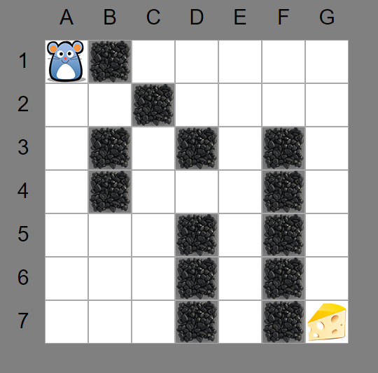

# Q-Learn demo (Typescript)

This is a demonstration of the Q-lern algorithm in Typescript.
__ONLINE-DEMO:__ [http://q-learn.byte-samurai.de/](http://q-learn.byte-samurai.de/)



It is based on [q-learner.js](https://github.com/nrox/q-learning.js?files=1) which was translated to Typescript.
Also its based the [Painless Q-Learning tutorial](http://mnemstudio.org/path-finding-q-learning-tutorial.htm)


This project was part of a seminar paper. Therefore there are no test available. Feel free to add some ;)

# Installation

1. Download project
1. Install dependencies
    ```
    npm install
    ```
1. Build files
```
npm run gulp
```
1. Run demo
```
npm run gulp watch
```


# Credits
Project is [MIT](LICENSE.txt)-licensed

Thanks to the images to:
 * Cheese: [Aha-Soft](http://www.iconarchive.com/show/desktop-buffet-icons-by-aha-soft/Cheese-icon.html)
 * Mouse:  [Mouse-Move-Projekt](https://movemouse.codeplex.com/)